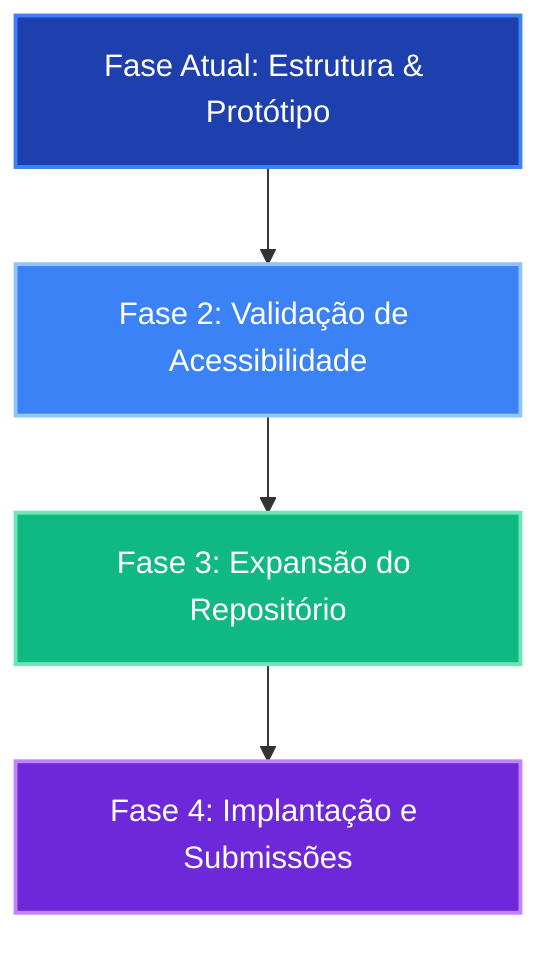

# Product Requirement Document (PRD) - IncluiDev

## 1. Visão Geral e Contexto
O projeto **IncluiDev** é um portal e repositório centralizado voltado ao **Ensino de Programação para Pessoas com Deficiência Visual (PcDV)**, desenvolvido como Trabalho de Conclusão de Curso (TCC) na **Universidade Federal de Mato Grosso do Sul (UFMS)**.

O ensino de programação é historicamente dependente de metáforas visuais (como diagramas de fluxo, indentação visual e blocos coloridos como Scratch). Para estudantes cegos ou com baixa visão, essa dependência cria barreiras de aprendizado severas. Embora existam dezenas de ferramentas, linguagens específicas (como Quorum), metodologias táteis (como Code Jumper) e pesquisas científicas de ponta, essas informações estão dispersas e fragmentadas na web, dificultando o acesso de professores, alunos e pesquisadores. 

O IncluiDev resolve este problema ao unificar, classificar e disponibilizar esses recursos de forma dinâmica e com acessibilidade plena.

---

## 2. Objetivos do Produto

### 2.1. Objetivo Geral
Desenvolver um portal web dinâmico e acessível que funcione como um repositório centralizado e classificado de recursos pedagógicos, ferramentas assistivas, metodologias e publicações científicas voltados ao ensino de programação para PcDV.

### 2.2. Objetivos Específicos
1. **Catalogação e Taxonomia:** Categorizar os recursos científicos e práticos em uma matriz bidimensional (Nível de Ensino × Público-Alvo).
2. **Plataforma Web Inclusiva (UI/UX):** Projetar uma interface de alta fidelidade visual (premium, moderna) que seja simultaneamente compatível com leitores de tela (NVDA, JAWS, VoiceOver), navegação por teclado e outras tecnologias assistivas (em conformidade com WCAG 2.1 AA).
3. **Geração de Documentação Acadêmica:** Manter um gerador de relatórios e fundamentação teórica para exportar a base de dados do TCC em formatos oficiais (`.docx`).

---

## 3. Público-Alvo e Personas

O produto é estruturado para atender a quatro categorias de público, divididos por nível de ensino e necessidade de informação:

| Público-Alvo | Necessidades Principais | Exemplos de Recursos Úteis |
| :--- | :--- | :--- |
| **Professores e Educadores** | Planos de aula adaptados, metodologias ativas de ensino, formação em AEE (Atendimento Educacional Especializado). | Guias de ensino de lógica tátil, artigos metodológicos, tutoriais de Scratch acessível. |
| **Alunos PcDV** | Tutoriais de ferramentas, atalhos de teclado, linguagens fáceis de usar com leitores de tela. | Linguagem Quorum, configuração de acessibilidade do VS Code, Swift Playgrounds. |
| **Público Geral** | Legislação, conscientização, guias introdutórios sobre inclusão tecnológica. | Lei Brasileira de Inclusão (LBI), cartilhas de acessibilidade web. |
| **Público Específico (Pesquisadores / Gestores)** | Revisões sistemáticas da literatura, teses sobre IDEs, diretrizes técnicas de acessibilidade. | Diretrizes de acessibilidade em IDEs (Zen & Tavares), Revisão Sistemática (Mendes et al.). |

---

## 4. Requisitos de Produto

### 4.1. Requisitos Funcionais (RF)

- **RF01 - Navegação por Categorias na Home:** A tela inicial deve conter atalhos e cards rápidos baseados em "Nível de Ensino" (Básico, Técnico, Superior) e "Público-Alvo" (Professores, Alunos, Pesquisadores) que aplicam o respectivo filtro e redirecionam o usuário para o repositório.
- **RF02 - Repositório de Conteúdos Filtrável:** Uma página dedicada com filtros suspensos (`<select>`) dinâmicos. Os filtros devem atualizar dinamicamente a URL (`SearchParams`) permitindo o compartilhamento de buscas específicas e facilitando a navegação com o botão "voltar" do navegador.
- **RF03 - Listagem de Recursos:** Apresentação dos recursos catalogados em cards com título, tipo do recurso (ex: IDE, artigo, metodologia), ano de publicação, descrição clara, autoria/referência resumida, tags de categorização e link direto para o conteúdo de origem.
- **RF04 - Script de Geração de Documento de TCC:** Um script standalone (`gerar_doc.js`) capaz de compilar o referencial teórico, matriz de classificação e dados do TCC em um arquivo `.docx` formatado (ABNT adaptada) usando bibliotecas de automação.

### 4.2. Requisitos Não-Funcionais (RNF)

- **RNF01 - Acessibilidade Web (Critério Crítico):**
  - Compatibilidade total com leitores de tela populares (NVDA, JAWS, VoiceOver).
  - Semântica de tags HTML5 estruturada (`<header>`, `<main>`, `<nav>`, `<article>`, `<section>`, `<footer>`).
  - Navegação fluida por teclado (`Tab`, `Shift+Tab`, `Enter`).
  - Uso correto de atributos ARIA (`aria-live="polite"` para listas de busca dinâmica, `aria-label`, `aria-hidden`, `tabIndex`).
  - Contraste visual elevado e fontes legíveis (ex: Arial, Outfit, Inter).
- **RNF02 - Estética e Design Premium:**
  - Interface visual limpa, harmoniosa e com estética moderna (tema escuro com glassmorphism, paleta de cores equilibrada como azul-safira e verde-esmeralda).
  - Animações e transições sutis (micro-interações de hover nos cards e botões).
- **RNF03 - Portabilidade e Performance:**
  - Carregamento extremamente rápido da página por meio de arquivos estáticos e banco de dados client-side (`conteudos.js`).
  - Arquitetura SPA (Single Page Application) usando React e Vite.
- **RNF04 - SEO Básico:**
  - Títulos de página descritivos, tags meta de descrição, hierarquia correta de headings (um único `<h1>` por página).

---

## 5. Taxonomia e Classificação de Conteúdo

O repositório classifica cada item de acordo com duas dimensões:

### 5.1. Dimensão 1: Nível de Ensino
1. **Ensino Básico (Fundamental e Médio):** Pensamento computacional inicial, lógica de programação básica, recursos lúdicos e tangíveis.
2. **Ensino Técnico (Profissionalizante):** Preparação profissional, linguagens textuais padrão de mercado (Python, Java), uso prático de IDEs configuradas.
3. **Ensino Superior (Graduação e Pós-Graduação):** Fundamentos científicos, algoritmos e estruturas de dados avançados, pesquisa acadêmica e engenharia de software inclusiva.

### 5.2. Dimensão 2: Público-Alvo
1. **Professor:** Metodologias didáticas e avaliações de recursos.
2. **Aluno:** Tutoriais diretos, IDEs e linguagens.
3. **Público Geral:** Legislação e conscientização.
4. **Público Específico:** Desenvolvedores de tecnologia assistiva, gestores e pesquisadores.

---

## 6. Arquitetura Técnica e Tecnologias

- **Lógica e UI:** React 18+ com Vite para bundle rápido.
- **Roteamento:** React Router DOM para controle de navegação e sincronização de query params.
- **Ícones:** Lucide React para sinalização semântica acessível.
- **Estilização:** CSS Customizado (`App.css` e `index.css`), evitando dependências complexas e garantindo flexibilidade total para acessibilidade.
- **Geração de Documentos:** Node.js + biblioteca `docx` para compilação do relatório acadêmico de TCC em formato Word.

---

## 7. Status Atual do Repositório (Conteúdos Catalogados)
Atualmente, o projeto possui 10 recursos fundamentais integrados diretamente em seu arquivo estático de dados (`conteudos.js`), mapeando:
1. **Quorum Language** (Linguagem / Ferramenta)
2. **Accessible Blockly** (Ferramenta / Framework)
3. **Code Jumper** (Metodologia / Hardware)
4. **Swift Playgrounds com VoiceOver** (Aplicativo)
5. **JBrick: IDE Acessível para LEGO** (IDE / Ferramenta)
6. **Acessibilidade no VS Code** (Guia)
7. **Diretrizes WCAG** (Norma Técnica)
8. **Physical Programming for Blind Children** (Artigo Acadêmico)
9. **Making Programming Accessible (Literature Review)** (Revisão de Literatura)
10. **A Systematic Review on Programming Skills (2024)** (Revisão Sistemática)

---

## 8. Roadmap e Próximas Fases

1. **Testes de Acessibilidade Práticos:** Submeter o portal à validação heurística de usabilidade e testes práticos com usuários PcDV, além de validações automatizadas com extensões de acessibilidade (Lighthouse, WAVE).
2. **Expansão da Base de Dados:** Adicionar os demais artigos e teses mapeados descritos no script `gerar_doc.js` (como a tese de Zen & Tavares de 2025 e o mapeamento de Santos et al. de 2025).
3. **Funcionalidade de Submissão de Recursos:** Permitir que novos professores ou pesquisadores submetam propostas de ferramentas ou artigos por meio de um formulário de contato ou pull request guiado (ex: gerador de JSON).
4. **Hospedagem e Produção:** Publicação do portal final na Vercel (com configuração do `vercel.json` já criada) ou Netlify, gerando a URL pública final para o TCC.
