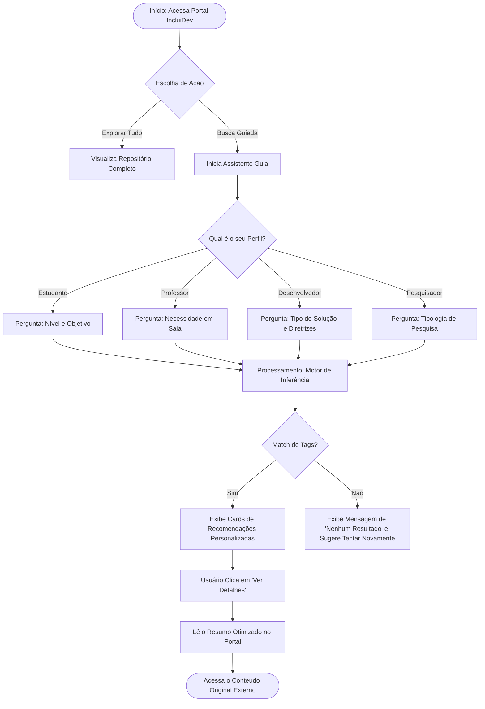

# Fluxograma e Casos de Uso do IncluiDev

Este documento apresenta a modelagem do sistema utilizando a notação de Diagrama de Casos de Uso (Use Case Diagram) e Fluxograma de Navegação. Estes diagramas podem ser anexados na seção de "Método" do artigo do TCC para ilustrar o design do sistema.

## 1. Diagrama de Casos de Uso (Use Cases)

Abaixo está o diagrama em formato Mermaid. Você pode visualizar este código em renderizadores online como o [Mermaid Live Editor](https://mermaid.live/) ou inseri-lo diretamente em documentações que suportem Markdown.

```mermaid
usecaseDiagram
    actor "Usuário Público" as UP
    actor "Estudante (PcDV)" as Est
    actor "Professor/Educador" as Prof
    actor "Pesquisador" as Pesq
    actor "Desenvolvedor" as Dev
    actor "Moderador (Admin)" as Admin

    %% Herança: Todos os perfis herdam de Usuário Público
    Est --|> UP
    Prof --|> UP
    Pesq --|> UP
    Dev --|> UP

    package "Portal IncluiDev" {
        usecase "Acessar Busca Guiada" as UC1
        usecase "Navegar no Repositório Completo" as UC2
        usecase "Ler Detalhes de um Conteúdo" as UC3
        usecase "Acessar Link Original do Recurso" as UC4
        usecase "Submeter Relato de Experiência" as UC5
        usecase "Responder Formulário de Avaliação" as UC6
        usecase "Realizar Login" as UC7
        usecase "Moderar Relatos (Aprovar/Rejeitar/Editar)" as UC8
    }

    UP --> UC1
    UP --> UC2
    UP --> UC3
    UP --> UC4
    UP --> UC5
    UP --> UC6

    Admin --> UC7
    Admin --> UC8
```

## 2. Fluxograma de Navegação do Assistente (Busca Guiada)

Este fluxograma ilustra o caminho lógico de um usuário ao interagir com o Assistente Guia, demonstrando como o sistema utiliza o motor de inferência baseado em *tags* para exibir os resultados.


